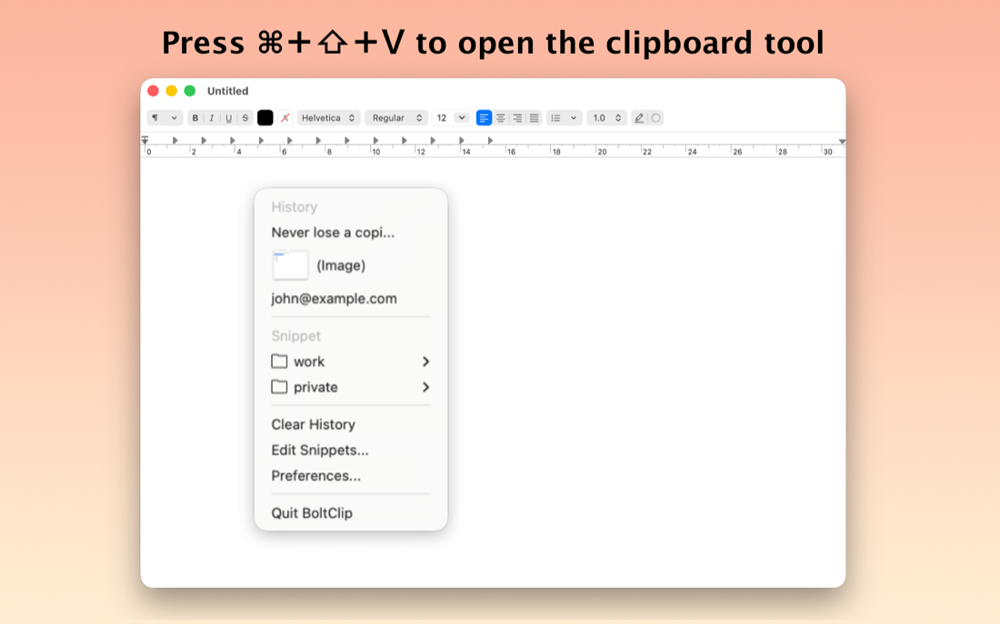
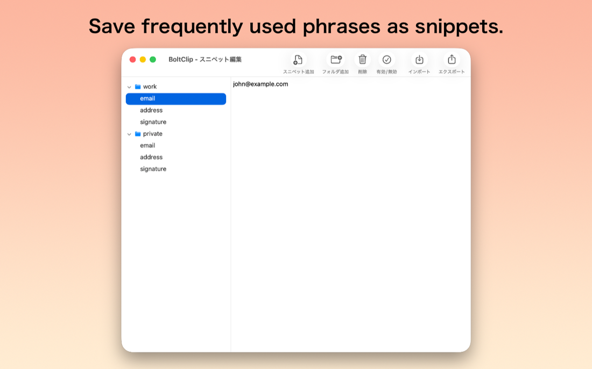

#  BoltClip for macOS

Stop losing track of your copy-paste history. BoltClip is a lightweight, high-performance clipboard manager designed for macOS, built to keep your workflow fluid and your data organized. Whether you are a developer, writer, or designer, BoltClip ensures that everything you copy is saved and ready for reuse.

## Screenshots

  
  

## Features

- **Clipboard history** — pull up your history anytime with a customizable shortcut
- **Snippets** — save frequently used text for instant reuse
- **Text and images** — works with both formats, not just plain text

## Download

For downloads and release notes, see [github.com/takebozu/BoltClip](https://github.com/takebozu/BoltClip).

[← Back to Lucid Works](../)
