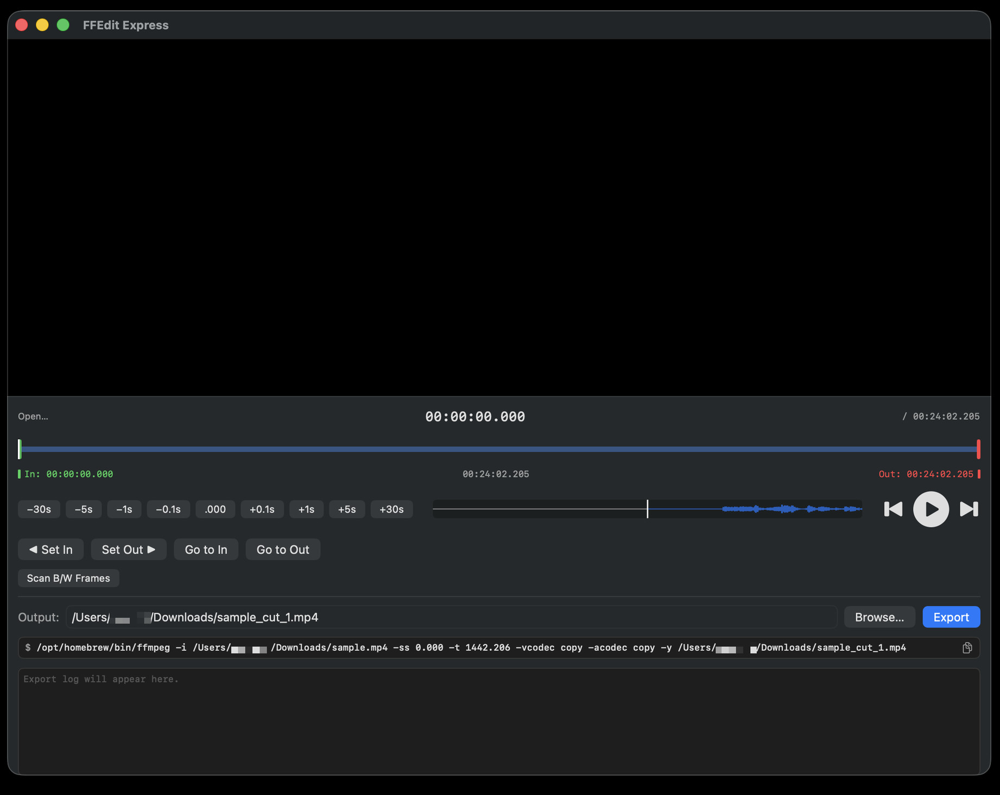

#  FFEdit Express for macOS

FFEdit Express is a simple video trimming tool built around ffmpeg. Set an in point and an out point, and export just that range as a lossless copy — fast, with no re-encoding and no quality loss.

## Screenshots

For how each control works, see the [User Guide](./guide-en.html).

## Features

- **Lossless export** — writes the selected range with ffmpeg's `-vcodec copy -acodec copy`, so there is no re-encoding, no quality loss, and it finishes quickly
- **Timeline scrubbing** — drag the playhead, in point, or out point directly on the timeline; the handle nearest where you start dragging is picked up automatically
- **In / out points** — Set In and Set Out mark the current position; Go to In and Go to Out jump back to them, and the length between them is shown on screen
- **Precise navigation** — jump forward or back by fixed steps from 0.1 second up to 30 seconds, or snap the current position to the nearest whole second
- **B/W frame scan** — automatically detects black and white frames (scene cuts lasting 0.5 seconds or longer) and marks them on the timeline, with Prev / Next to step between markers
- **Copy the ffmpeg command** — copy the exact `ffmpeg …` command to the clipboard and run it in Terminal yourself
- **Auto-named output** — suggests a `_cut` output path, and adds `_1`, `_2`, … automatically if a file with that name already exists

## Requirements

- macOS 14 or later
- ffmpeg (install with Homebrew: `brew install ffmpeg`)

## Download

[Download FFEdit Express v1.0 (.zip)](/downloads/FFEditExpress_v1.0.zip)

1. Download and unzip the file.
2. Move **FFEdit Express.app** into your **Applications** folder.
3. Launch it from Applications. On first launch, if macOS blocks the app, right-click it and choose **Open**.

FFEdit Express needs ffmpeg — see [Requirements](#requirements) above.

[← Back to Lucid Works](../)
