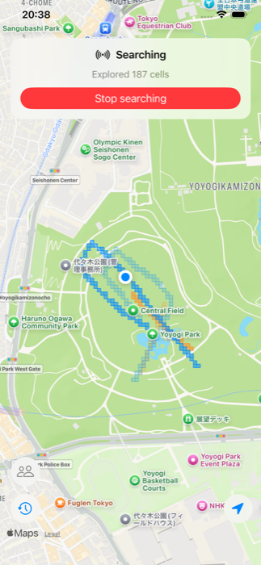
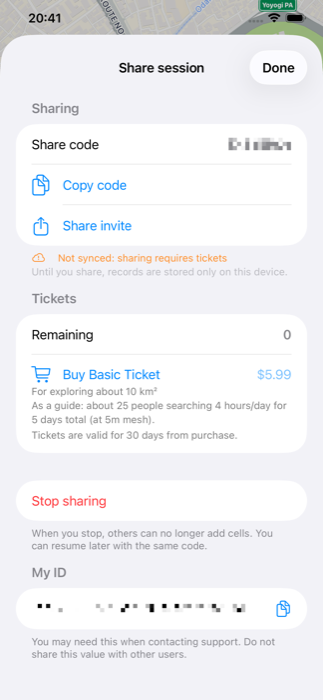

#  GridFinder for iOS

GridFinder shows you at a glance where you've already searched.

As you walk, the ground you've covered gets shaded onto the map as a mesh of grid cells. Covered cells fill in, so it's immediately clear what's left to search and what's already done — no more covering the same spot twice or missing a corner.

Built for any "search every inch" situation:

- Looking for lost items, keys, or belongings
- Searching for a missing pet
- Foraging for wild plants or mushrooms, beachcombing
- Ground searches, field surveys, patrols

## Screenshots

  
  

## Features

- **Coverage tracking** — your path is recorded on the map cell by cell, filling in the area you've covered
- **Adjustable resolution** — choose a 5 m, 10 m, or 20 m grid to control how finely coverage is tracked
- **Auto-stop timer** — set a time to automatically stop recording
- **Search history** — sessions save automatically; reopen a past search and overlay it on the map to compare
- **Search together** (optional) — share an 8-character code to split a large area with others. Everyone's covered cells update in real time, so no one covers the same ground twice — your cells show in a darker shade, your teammates' in a lighter one

GridFinder keeps things simple: just the map and your current location.

*Real-time collaborative search uses in-app purchase tickets. Solo search and history are always free.*

## Download

Available soon on the App Store.

[Privacy Policy](./PrivacyPolicy-en.html) · [Support](../general/Support-en.html)

[← Back to Lucid Works](../)
