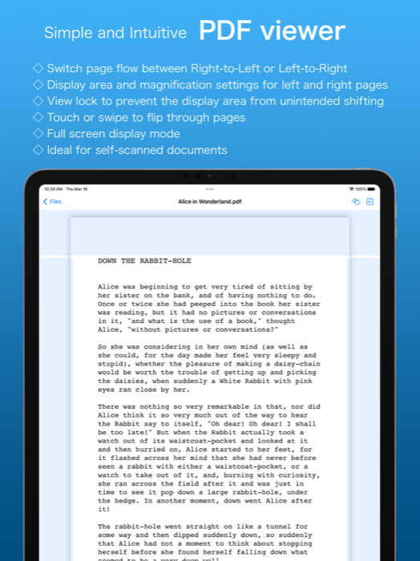
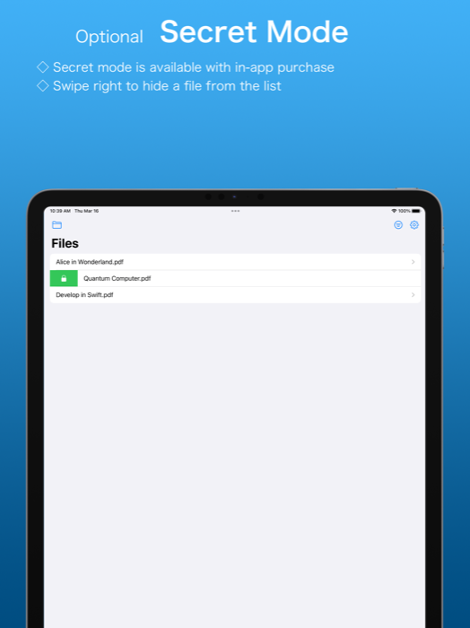

#  Lucid Reader for iOS

Lucid Reader is designed to provide a seamless and distraction-free experience for simply reading PDFs, whether they are standard files or documents you've scanned yourself.

## Screenshots

  
  

## Features

- **Intuitive page turning** — swipe or tap through pages naturally
- **Right-to-left or left-to-right binding** — supports vertical-text books
- **Optimized display** — independent zoom and display area per page to minimize margins
- **Page lock** — prevents accidental shifts from stray touches
- **Full-screen reading**
- **Collections** — organize multiple files together
- **Pro** (in-app purchase) — multiple collections, hidden files, Face ID / Touch ID lock

## Download

Click the button below to download, or search for "Lucid Reader" on the App Store.

[Privacy Policy](./PrivacyPolicy-en.html) · [Support](./Support-en.html)

[← Back to Lucid Works](../)
