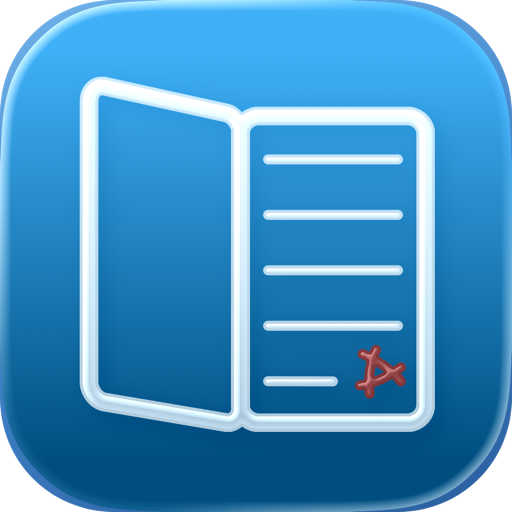
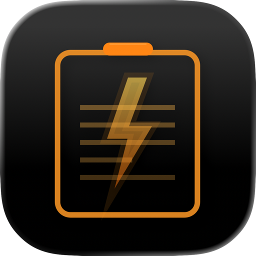

# &nbsp;Lucid Reader for iOS

Lucid Reader is designed to provide a seamless and distraction-free experience for simply reading PDFs, whether they are standard files or documents you've scanned yourself.

## Download

Click the button below to download.
Or search for "Lucid Reader" on the App Store.

Privacy Policy

<ul>
<li><a href="./LucidReader/PrivacyPolicy-en.md">English</a></li>
<li><a href="./LucidReader/PrivacyPolicy-ja.md">日本語</a></li>
</ul>

Support

<ul>
<li><a href="./LucidReader/Support-en.md">English</a></li>
<li><a href="./LucidReader/Support-ja.md">日本語</a></li>
</ul>

 
 

# &nbsp;BoltClip for macOS

Stop losing track of your copy-paste history. BoltClip is a lightweight, high-performance clipboard manager designed for macOS, built to keep your workflow fluid and your data organized. Whether you are a developer, writer, or designer, BoltClip ensures that everything you copy is saved and ready for reuse.

## Download

For downloads, please see [github.com/takebozu/BoltClip](https://github.com/takebozu/BoltClip).

