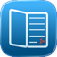
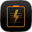

Lucid Works is an independent developer studio building small, practical apps for iOS and macOS. Every app is designed around one job, done well, without clutter.

## Our Apps

<a href="./LucidReader/"> Lucid Reader for iOS</a>

A distraction-free PDF reader for standard files and scanned documents.

<a href="./GridFinder/"> GridFinder for iOS</a>

An app that divides a map into a grid to help you search comprehensively.

<a href="./BoltClip/"> BoltClip for macOS</a>

A lightweight, high-performance clipboard manager that keeps your copy-paste history organized.
